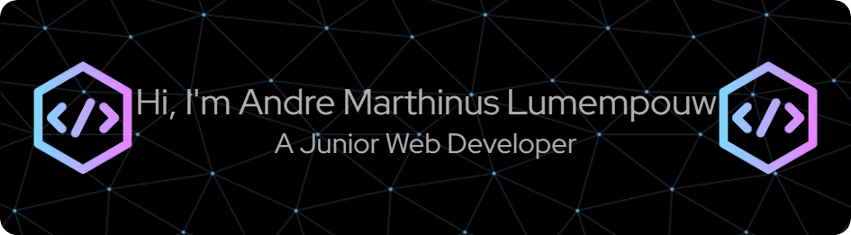

I'm Andre Marthinus Lumempouw, a student at Universitas Mulia Balikpapan, currently learning and developing my skills in frontend and backend web development. I'm passionate about building responsive and user-friendly web applications, and I’m continuously exploring new technologies to grow as a full-stack developer.

###

<h3 align="left">Skills</h3>

###

  
  
  
  
  
  
  
  
  
  
  
  
  

###

<h3 align="left">Connect With Me</h3>

###

  
  

###

###